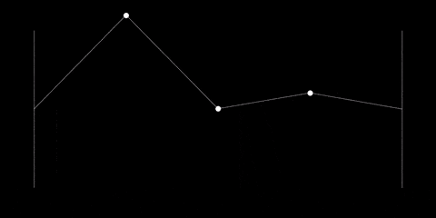

# FrequenPy

_FrequenPy_ is a high-precision physics engine dedicated to the study of standing waves and visualization of its normal modes.

<p align="center">

</p>
## Table of Contents

- [Motivation](#motivation)
- [Theoretical background](#theoretical-background)
- [Requirements](#requirements)
- [Documentation](#documentation)
- [Usage](#usage)
	* [Cloning the repo](#cloning-the-repo)
	* [Installing dependencies](#installing-dependencies)
	* [Configuration](#configuration)
	* [Execution](#execution)
- [Ideas](#ideas)

## Motivation

The project was conceived as an exercise to grasp more profoundly the concepts behind the wave theory of physics learnt at the university, in particular standing waves, whose visualizations i consider very beautiful and didactic. At first consisted of a single python script, but later i decided to transform the script into a well designed software to practice my general skills as a developer and keep discovering features in python (language that i fell in love with). Also, to be able to share this to anyone interested in learning something about this beatiful branch of physics, or maybe to help some undergraduate student with his studies. 
However, if you really want to learn the physics behind, I encourage you to code some of this exercises by yourself.

The idea is to keep adding differents physics systems that are valuable to visualize and to play with, as long as my free time and knowledge allow me.  

## Theoretical background

I will improve this section later by adding a minimal mathematical derivations and important equations to understad better the systems in question. 

For now, the only system available to play with is a beaded string loaded with N masses (N degrees of freedom), oscillating transversally. The theory says that any arbitrary movement of the string can be decomposed into a superposition of natural modes of oscillation, that have the particularity that when the system is oscillating in one of this natural modes, all masses in the system move at the same frequency and pass through the equilibrium position at the same time. This natural modes of oscillation are called normal modes. There are as many normal modes as there are degrees of freedom in the system. So, a string loeaded with 10 masses, will have 10 natural frequencies, the first being the lowest (called fundamental) and each next higher than the previous one, until reaching the last and highest frequency. Any movement, as strange as it may be, can be expressed as a superposition of those 10 normal modes (some will contribute more than others to the final movement). 

As the number of masses gets higher (Ideally, N --> inf), we approximate to the continuous system, that is, a vibrating string (no discrete masses). With N = 40 you can see the effect. 

To be completed. 

## Requirements

Frequenpy uses Python3. 

## Documentation

To be completed. 

## Usage

### Cloning the repo
First of all, clone the repository:
```
git clone https://github.com/tomasjuanlink/frequenpy.git
```

### Installing dependencies

Frequenpy uses numpy and matplotlib. To install them just run:
```
pip3 install -r requirements.txt
```

### Configuration

Before running, you can play with the parameters of the system in the settings.py. Remember there is one normal mode per mass in the system. You can make a list of only one of them, or a combination of several normal modes. The order doesn't matter. Boundary condition can be 0, 1, or 2, meaning Fixed ends, free ends, or mixed ends (left fixed and right free). The speed parameter is important because for very high frequencies, which can appear if the number of masses is high, the appreciation of the movement can be difficult, and it is convenient to reduce the speed of the animation.

```python
NUMBER_OF_MASSES = 5
NORMAL_MODES = [2, 5]
BOUNDARY_CONDITION = 0
SAVE_ANIMATION = False
SPEED = 1
```

### Execution

Just run:

```
python3 client.py
```

## Ideas

-At this moment i'm working on an interactive GUI-client to be able to play more easily with all the parameters of the system. 

-Add one plot for each individual normal mode that is contributing to the movement. 

-Introduce damping and tension of the string as parameters to play with.

-Add definition of initial conditions to generate more arbitrary and crazy movements of the string, like picking the string with your mouse and realease it from some position. 

-Add other systems. 


